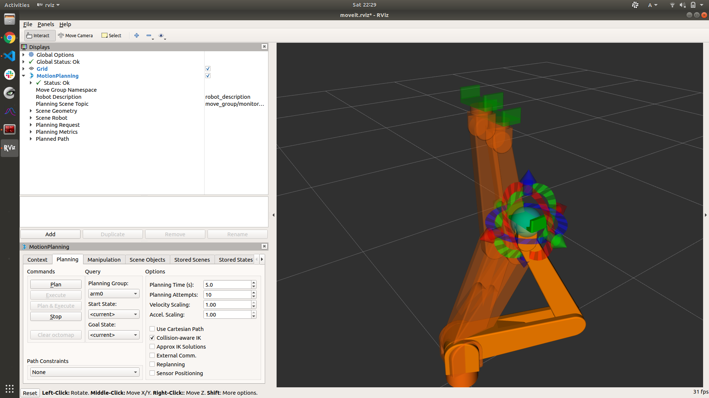

# Catchrobo 2021 ROS

## Environment
- ubuntu 18
- ros melodic

## Requirement
- moveit (see : https://moveit.ros.org/install/)
- sudo apt install ros-melodic-joint-state-publisher-gui 
- pip install pandas numpy
- sudo apt install ros-melodic-joy
- sudo apt install ros-melodic-joystick-drivers 


## How to use
### Display robot in Rviz
Without field:
```
roslaunch catchrobo_description catchrobo_display.launch 
```
With field (blue/red):
```
roslaunch catchrobo_description catchrobo_display.launch field:=blue
```
### Execute motion planning with Moveit
demo:
```
roslaunch catchrobo_moveit demo.launch 
```


### simulation for catchrobo
- roslaunch catchrobo_bringup bringup.launch #実機用
- roslaunch catchrobo_bringup sim_bringup.launch #PCsim
- rosrun catchrobo_manager game_manager.py


<!-- 
## IKFast  
- download following by http://docs.ros.org/en/melodic/api/moveit_tutorials/html/doc/ikfast/ikfast_tutorial.html  (export MYROBOT_NAME=" catchrobo_description/robots/catchrobo")  
- display collada file:
```
$ openrave-robot.py catchrobo_description/robots/catchrobo.dae --info links

name              index parents          
-----------------------------------------
world             0                      
base/base_link    1     world            
base/link_tip     2     base/base_link   
arm/link0         3     base/link_tip    
arm/link1         4     arm/link0        
arm/link2         5     arm/link1        
arm/link3         6     arm/link2        
arm/link4         7     arm/link3        
arm/link5         8     arm/link4        
arm/link_tip      9     arm/link5        
gripper/base_link 10    arm/link_tip     
gripper/finger1   11    gripper/base_link
gripper/finger2   12    gripper/base_link
gripper/link_tip  13    gripper/base_link
-----------------------------------------
name              index parents          

```
- generate IK solver
```
python `openrave-config --python-dir`/openravepy/_openravepy_/ikfast.py --robot=catchrobo_description/robots/catchrobo.dae --iktype=transform6d --baselink="2" --eelink="8" --savefile="`pwd`/catchrobo_IKFast/ikfast61_arm0.cpp"
``` -->
